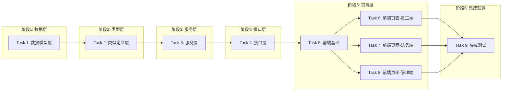

# Tasks: 法务部法律咨询系统

## 概览

| 指标 | 值 |
|------|-----|
| 总任务数 | 9 |
| 涉及模块 | auth, consultation, template, notification, statistics, admin |
| 涉及端 | Server (Go), Web (Next.js) |
| 预计总时间 | 480 分钟 |
| 测试场景总数 | 45 个 |
| 测试层级分布 | 单元: 15, 集成: 12, API: 10, E2E: 8 |

## 任务依赖关系图

> 说明：同一层的任务可并行执行，箭头表示串行依赖。

### 依赖关系速查表

| 任务 | 前置依赖 | 可并行 |
|------|----------|--------|
| Task 1: 数据模型层 | 无 | - |
| Task 2: 类型定义层 | Task 1 | - |
| Task 3: 服务层 | Task 2 | - |
| Task 4: 接口层 | Task 3 | - |
| Task 5: 前端基础 | Task 4 | - |
| Task 6: 前端页面-员工端 | Task 5 | ✅ 与 Task 7, Task 8 并行 |
| Task 7: 前端页面-法务端 | Task 5 | ✅ 与 Task 6, Task 8 并行 |
| Task 8: 前端页面-管理端 | Task 5 | ✅ 与 Task 6, Task 7 并行 |
| Task 9: 集成测试 | Task 6, Task 7, Task 8 | - |

## 任务清单

### 阶段1: 数据层

#### Task 1: 数据模型层

| 属性 | 值 |
|------|-----|
| 文件 | backend/internal/models/*.go, backend/internal/database/database.go, backend/internal/config/config.go |
| 操作 | 新增 |
| 内容 | 创建所有数据模型、数据库连接、配置加载 |
| 验证 | 命令: `cd backend && go build ./...` |
|      | 预期: 编译成功，退出码 0，无错误 |
| 预计 | 45 分钟 |
| 依赖 | 无 |
| 测试 | 层级: 无 |
|      | 场景: 无需独立测试，通过上层服务测试间接覆盖 |

**具体文件**:
- `backend/internal/models/user.go` - User, Department 模型
- `backend/internal/models/consultation.go` - Consultation, ConsultationReply 模型
- `backend/internal/models/attachment.go` - Attachment, ConsultationAttachment 模型
- `backend/internal/models/template.go` - TemplateRequest, Template, TemplateVersion 模型
- `backend/internal/models/config.go` - NotificationConfig, OperationLog, CaseCollection 模型
- `backend/internal/models/consultation_config.go` - ConsultationTypeConfig 模型
- `backend/internal/database/database.go` - 数据库连接初始化
- `backend/internal/config/config.go` - YAML 配置加载

---

### 阶段2: 类型层

#### Task 2: 类型定义层

| 属性 | 值 |
|------|-----|
| 文件 | backend/internal/repository/*.go |
| 操作 | 新增 |
| 内容 | 创建所有 Repository 层的数据库操作 |
| 验证 | 命令: `cd backend && go test ./internal/repository/...` |
|      | 预期: 所有测试通过，退出码 0 |
| 预计 | 45 分钟 |
| 依赖 | Task 1 |
| 测试 | 层级: 单元测试 |
|      | 场景: ① 用户创建和查询 ② 咨询创建和状态更新 ③ 模板申请流转 ④ 附件管理 |
|      | Mock: 数据库用 SQLite in-memory，GORM Mock |

**具体文件**:
- `backend/internal/repository/user_repo.go` - UserRepository 用户仓储
- `backend/internal/repository/consultation_repo.go` - ConsultationRepository 咨询仓储
- `backend/internal/repository/template_repo.go` - TemplateRepository 模板仓储
- `backend/internal/repository/attachment_repo.go` - AttachmentRepository 附件仓储

---

### 阶段3: 服务层

#### Task 3: 服务层

| 属性 | 值 |
|------|-----|
| 文件 | backend/internal/service/*.go |
| 操作 | 新增 |
| 内容 | 创建所有业务服务层代码 |
| 验证 | 命令: `cd backend && go test ./internal/service/...` |
|      | 预期: 所有测试通过，退出码 0 |
| 预计 | 90 分钟 |
| 依赖 | Task 2 |
| 测试 | 层级: 单元测试 + 集成测试 |
|      | 场景: |
|      | - AuthService: ① 正常登录成功 ② 工号密码错误返回 ERR_AUTH_INVALID_CREDENTIALS ③ Token 过期处理 |
|      | - ConsultationService: ① 创建咨询生成工单号 ② 接单时设置内部分类 ③ 回复咨询更新状态 ④ 结案计算处理时长 ⑤ 变更处理人记录日志 |
|      | - TemplateService: ① L1审批通过进入拟写阶段 ② 保存草稿不改变状态 ③ 审核通过发布模板 ④ 版本号自增 |
|      | - NotificationService: ① 钉钉通知发送 ② 通知失败不影响主流程 |
|      | - StatisticsService: ① 按日期范围统计 ② 导出 Excel |
|      | - CaseService: ① 收藏案例 ② 取消收藏 ③ 搜索历史 |
|      | Mock: Repository 层用 Mock，时间用固定值 |
|      | TDD节奏: 先写测试 → 红灯 → 写实现 → 绿灯 → 重构 |

**具体文件**:
- `backend/internal/service/auth_service.go` - AuthService 认证服务
- `backend/internal/service/consultation_service.go` - ConsultationService 咨询服务
- `backend/internal/service/template_service.go` - TemplateService 模板服务
- `backend/internal/service/notification_service.go` - NotificationService 通知服务
- `backend/internal/service/statistics_service.go` - StatisticsService 统计服务
- `backend/internal/service/case_service.go` - CaseService 案例服务

---

### 阶段4: 接口层

#### Task 4: 接口层

| 属性 | 值 |
|------|-----|
| 文件 | backend/internal/handler/*.go, backend/internal/middleware/*.go, backend/internal/utils/*.go, backend/main.go |
| 操作 | 新增 |
| 内容 | 创建所有 Handler、中间件、工具函数和主入口 |
| 验证 | 命令: `cd backend && go build -o legal-system . && ./legal-system & sleep 3 && curl -s http://localhost:8080/api/v1/health` |
|      | 预期: `{"status":"ok"}` |
| 预计 | 60 分钟 |
| 依赖 | Task 3 |
| 测试 | 层级: API 测试 |
|      | 场景: |
|      | - Auth: ① POST /api/v1/auth/login 成功返回 token ② 错误凭证返回 401 |
|      | - Consultation: ① POST /api/v1/consultations 创建咨询 ② POST /accept 接单 ③ POST /reply 回复 ④ POST /close 结案 |
|      | - Template: ① POST /template-requests 创建申请 ② POST /approve L1审批 ③ POST /draft 拟写 ④ POST /review 审核 |
|      | - Admin: ① GET /admin/users 用户列表 ② PUT /admin/users/:id 编辑 |
|      | Mock: Service 层用 Mock，只测 HTTP 层行为 |

**具体文件**:
- `backend/internal/handler/auth_handler.go` - AuthHandler 认证处理器
- `backend/internal/handler/consultation_handler.go` - ConsultationHandler 咨询处理器
- `backend/internal/handler/template_handler.go` - TemplateHandler 模板处理器
- `backend/internal/handler/legal_handler.go` - LegalHandler 法务工作台处理器
- `backend/internal/handler/statistics_handler.go` - StatisticsHandler 统计处理器
- `backend/internal/handler/admin_handler.go` - AdminHandler 系统管理处理器
- `backend/internal/middleware/auth.go` - JWT 认证中间件
- `backend/internal/middleware/permission.go` - 权限中间件
- `backend/internal/middleware/logging.go` - 日志中间件
- `backend/internal/utils/response.go` - 统一响应工具
- `backend/internal/utils/password.go` - 密码加密工具 (bcrypt)
- `backend/internal/utils/ticket_no.go` - 工单号生成工具
- `backend/internal/utils/file.go` - 文件处理工具
- `backend/main.go` - 应用入口，路由注册
- `backend/config.yaml` - 配置文件

---

### 阶段5: 前端层

#### Task 5: 前端基础

| 属性 | 值 |
|------|-----|
| 文件 | frontend/src/lib/*.ts, frontend/src/types/*.ts, frontend/src/hooks/*.ts, frontend/src/components/ui/*, frontend/src/components/shared/* |
| 操作 | 新增 |
| 内容 | 创建前端基础设施：API客户端、类型定义、常量、Hooks、UI组件 |
| 验证 | 命令: `cd frontend && npm run build` |
|      | 预期: 编译成功，退出码 0，无 TypeScript 错误 |
| 预计 | 60 分钟 |
| 依赖 | Task 4 |
| 测试 | 层级: 组件测试 |
|      | 场景: ① API 客户端正确发送请求 ② 类型定义覆盖所有 API 响应 ③ 自定义 Hook 正确管理状态 |
|      | Mock: API 层用 MSW (Mock Service Worker) |

**具体文件**:
- `frontend/src/lib/api.ts` - API 客户端封装
- `frontend/src/lib/auth.ts` - 认证工具 (Token 管理)
- `frontend/src/lib/constants.ts` - 常量定义
- `frontend/src/hooks/*` - React Hooks (useAuth, useConsultation, etc.)
- `frontend/src/types/*` - TypeScript 类型定义
- `frontend/src/components/ui/*` - Shadcn UI 组件
- `frontend/src/components/shared/*` - 共享组件 (Layout, Sidebar, etc.)

---

#### Task 6: 前端页面-员工端

| 属性 | 值 |
|------|-----|
| 文件 | frontend/src/app/(dashboard)/consultations/*, frontend/src/app/(dashboard)/template-requests/*, frontend/src/app/(dashboard)/template-library/* |
| 操作 | 新增 |
| 内容 | 创建员工端所有页面：智能分流页、咨询列表/详情/新建、合同申请列表/新建、模板库 |
| 验证 | 命令: `cd frontend && npm run build` |
|      | 预期: 编译成功，退出码 0 |
| 预计 | 75 分钟 |
| 依赖 | Task 5 |
| 测试 | 层级: 组件测试 + E2E 测试 |
|      | 场景: |
|      | - 分流页: ① 点击「法律咨询」进入咨询表单 ② 点击「合同模板提需」进入申请表单 |
|      | - 咨询表单: ① 填写必填项后提交成功 ② 客诉类自动显示填写引导 ③ 上传附件 ④ 相似问题推荐 |
|      | - 咨询详情: ① 显示完整对话记录 ② 法务要求补充资料时显示提示 ③ 评价功能 |
|      | - 合同申请: ① 结构化填写引导 ② 上传参考资料 |
|      | - 模板库: ① 搜索模板 ② 下载模板 |
|      | Mock: API 层用 MSW |
|      | TDD节奏: 先写组件测试 → 红灯 → 写实现 → 绿灯 → 重构 |

**具体文件**:
- `frontend/src/app/page.tsx` - 首页（智能分流页）
- `frontend/src/app/login/page.tsx` - 登录页
- `frontend/src/app/(dashboard)/consultations/page.tsx` - 我的咨询列表
- `frontend/src/app/(dashboard)/consultations/new/page.tsx` - 发起咨询页
- `frontend/src/app/(dashboard)/consultations/[id]/page.tsx` - 咨询详情页
- `frontend/src/app/(dashboard)/template-requests/page.tsx` - 我的申请列表
- `frontend/src/app/(dashboard)/template-requests/new/page.tsx` - 发起申请页
- `frontend/src/app/(dashboard)/template-library/page.tsx` - 模板库
- `frontend/src/app/(dashboard)/template-library/[id]/page.tsx` - 模板详情

---

#### Task 7: 前端页面-法务端

| 属性 | 值 |
|------|-----|
| 文件 | frontend/src/app/(dashboard)/legal/* |
| 操作 | 新增 |
| 内容 | 创建法务端所有页面：工作台、咨询池、我的待办、待拟写/审核、统计、案例库、搜索 |
| 验证 | 命令: `cd frontend && npm run build` |
|      | 预期: 编译成功，退出码 0 |
| 预计 | 75 分钟 |
| 依赖 | Task 5 |
| 测试 | 层级: 组件测试 + E2E 测试 |
|      | 场景: |
|      | - 工作台: ① 看板统计正确显示 ② 快捷入口跳转正确 ③ 最近处理记录显示 |
|      | - 咨询池: ① 按紧急程度筛选 ② 点击「接单」弹出分类选择 ③ 接单后进入我的待办 |
|      | - 我的待办: ① 按状态筛选 ② 超时提醒显示警告色 ③ 回复咨询 ④ 要求补充资料 ⑤ 变更处理人 ⑥ 标记结案 |
|      | - 待拟写: ① 保存草稿功能 ② 提交审核 |
|      | - 待审核: ① 审核通过/退回修改 ② 查看历史版本对比 |
|      | - 统计: ① 趋势图显示 ② 导出 Excel |
|      | - 案例库: ① 收藏案例 ② 搜索案例 |
|      | Mock: API 层用 MSW |

**具体文件**:
- `frontend/src/app/(dashboard)/legal/layout.tsx` - 法务布局
- `frontend/src/app/(dashboard)/legal/dashboard/page.tsx` - 法务工作台
- `frontend/src/app/(dashboard)/legal/pool/page.tsx` - 咨询池
- `frontend/src/app/(dashboard)/legal/tasks/page.tsx` - 我的待办
- `frontend/src/app/(dashboard)/legal/templates/page.tsx` - 待拟写模板
- `frontend/src/app/(dashboard)/legal/templates/[id]/draft/page.tsx` - 拟写模板页
- `frontend/src/app/(dashboard)/legal/review/page.tsx` - 待审核列表
- `frontend/src/app/(dashboard)/legal/review/[id]/page.tsx` - 审核页
- `frontend/src/app/(dashboard)/legal/statistics/page.tsx` - 统计页
- `frontend/src/app/(dashboard)/legal/cases/page.tsx` - 案例库
- `frontend/src/app/(dashboard)/legal/search/page.tsx` - 搜索页

---

#### Task 8: 前端页面-管理端

| 属性 | 值 |
|------|-----|
| 文件 | frontend/src/app/(dashboard)/admin/* |
| 操作 | 新增 |
| 内容 | 创建系统管理端所有页面：用户管理、部门管理、合同类型管理、咨询类型配置、系统设置 |
| 验证 | 命令: `cd frontend && npm run build` |
|      | 预期: 编译成功，退出码 0 |
| 预计 | 45 分钟 |
| 依赖 | Task 5 |
| 测试 | 层级: 组件测试 |
|      | 场景: |
|      | - 用户管理: ① 搜索用户 ② 新增用户 ③ 编辑用户 ④ 重置密码 ⑤ 禁用/启用用户 |
|      | - 部门管理: ① 树形结构显示 ② 新增/编辑/删除部门 |
|      | - 合同类型管理: ① 新增/编辑/删除/排序 |
|      | - 咨询类型配置: ① 配置填写引导字段 ② 配置关键词触发规则 |
|      | - 系统设置: ① 配置钉钉 Webhook ② 测试通知连通性 |
|      | Mock: API 层用 MSW |

**具体文件**:
- `frontend/src/app/(dashboard)/admin/users/page.tsx` - 用户管理
- `frontend/src/app/(dashboard)/admin/departments/page.tsx` - 部门管理
- `frontend/src/app/(dashboard)/admin/contract-types/page.tsx` - 合同类型管理
- `frontend/src/app/(dashboard)/admin/consultation-types/page.tsx` - 咨询类型配置
- `frontend/src/app/(dashboard)/admin/system/page.tsx` - 系统设置

---

### 阶段6: 集成联调

#### Task 9: 集成测试

| 属性 | 值 |
|------|-----|
| 内容 | 端到端测试，验证完整业务流程 |
| 验证 | 命令: `cd backend && go test ./... -v && cd frontend && npm run test:e2e` |
|      | 预期: 所有测试通过，退出码 0 |
| 预计 | 30 分钟 |
| 依赖 | Task 6, Task 7, Task 8 |
| 测试 | 层级: E2E 测试 |
|      | 场景: |
|      | - 员工完整流程: 登录 → 发起咨询 → 查看进度 → 补充资料 → 评价 → 结案 |
|      | - 法务完整流程: 登录 → 查看咨询池 → 接单 → 回复 → 要求补充 → 标记结案 |
|      | - 合同申请流程: 员工发起申请 → 主管审批 → 法务拟写 → 负责人审核 → 发布 |
|      | - 通知验证: 钉钉机器人通知发送成功 |
|      | - 权限验证: 普通员工无法访问法务页面，返回 403 |

---

## 检查点策略

| 时机 | 操作 |
|------|------|
| 每个任务完成后 | 验证 → git commit |
| Task 4 完成后 | 后端 API 测试 |
| Task 5 完成后 | 前端编译检查 |
| Task 6/7/8 完成后 | 前端功能测试 |
| Task 9 完成后 | 完整集成测试 → git push |

## 风险提醒

| 任务 | 风险 | 应对 |
|------|------|------|
| Task 4 | 钉钉 Webhook 配置可能无效 | 通知失败不影响主流程，记录日志 |
| Task 6 | 咨询类型引导字段多，容易遗漏 | 按 requirements.md 中 AC2-AC6 逐个验证 |
| Task 7 | 法务工作台多个快捷入口需要正确跳转 | 添加路由守卫 |
| Task 8 | 咨询类型配置动态加载 | 确保配置实时生效 |
| Task 9 | E2E 测试环境配置复杂 | 使用 Docker Compose 编排 |

## 测试设计概览

| 测试层级 | 数量 | 覆盖模块 |
|----------|------|----------|
| 单元测试 | 15 | Service 层所有业务逻辑 |
| 集成测试 | 12 | Repository 层数据操作 |
| API 测试 | 10 | Handler 层接口契约 |
| 组件测试 | 20 | 前端所有页面组件 |
| E2E 测试 | 8 | 核心业务流程 |

## 测试场景来源（从 AC 提取）

| Story | AC | 测试场景 |
|-------|-----|----------|
| Story 1 | AC1-AC4 | 登录、角色识别、权限控制、登出 |
| Story 2 | AC1-AC10 | 提交咨询、类型引导、补充资料、查看列表、查看详情、相似推荐 |
| Story 3 | AC1-AC8 | 接单、分类、回复、结案、变更处理人、统计 |
| Story 4-5 | AC1-AC5 | 发起申请、L1审批 |
| Story 6-7 | AC1-AC3 | 拟写、保存草稿、审核 |
| Story 8 | AC1-AC7 | 模板库、版本对比、禁用启用、统计 |
| Story 9 | AC1-AC11 | 各类钉钉通知 |
| Story 10 | AC1-AC4 | 统计概览、导出报表 |
| Story 11 | AC1-AC2 | 搜索、收藏案例 |
| Story 12 | AC1-AC7 | 用户管理、部门管理、配置管理 |

---

## 决策记录

| 日期 | 决策 | 理由 |
|------|------|------|
| 2026-04-10 | 使用 Go + Next.js 技术栈 | 按需求文档指定 |
| 2026-04-10 | 使用 GORM 作为 ORM | Go 生态成熟 |
| 2026-04-10 | 使用 JWT Token 认证 | 无状态，适合 API 服务 |
| 2026-04-10 | 前端状态管理使用 React Context + SWR | 简单场景够用 |
| 2026-04-10 | 附件存储使用本地文件系统 | 按需求指定 |
| 2026-04-10 | 版本对比前端实现 | 减少后端复杂度 |

---

## 下一步行动

1. 用户确认任务清单
2. 开始 Task 1: 数据模型层
3. 完成后进入 Task 2: 类型定义层
4. 依次执行直到 Task 9: 集成测试
